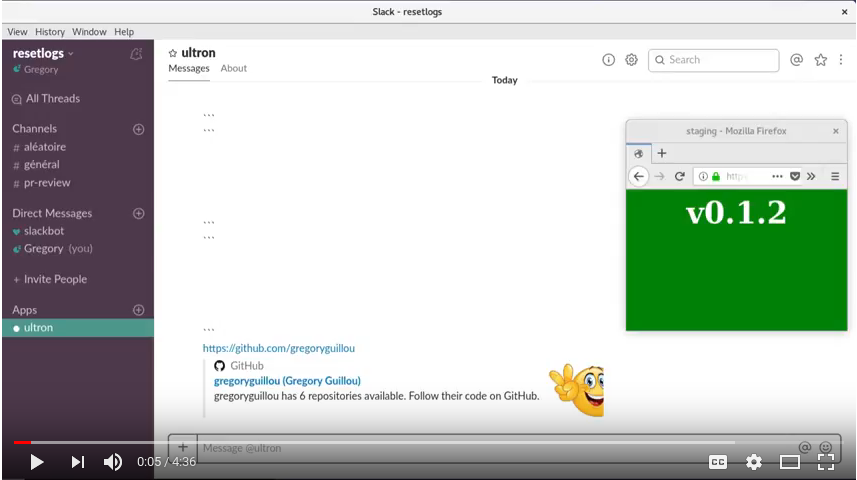

# Terraform API

`Terraform API` helps you manage Terraform projects and workspaces from the
Cloud. Access them securely from a command line or via a REST API. You should be
able to use Terraform from anywhere and:

- Create and destroy development, training or demonstration environments 
  on-demand.
- Update environments on-demand from a git branch/tag
- Add and create environments, any time, from a scheduler and keep your
  stacks clean and lean
- Build temporary infrastructure for demonstration and training
- Publish SaaS applications to your customers
- Integrate other tools and be creative...

## Short demo

The Youtube video below shows an example of what can be done with this API. It
relies on Slack and Hubot to apply/destroy a Terraform project:

## Try it

Try `Terraform API` now. Read and comment the documents below:

- [A step-by-step demonstration of Terraform-api with Consul](https://github.com/gregoryguillou/terraform-api/blob/master/docs/TUTORIAL.md)
- [The concept guide](https://github.com/gregoryguillou/terraform-api/blob/master/docs/CONCEPT.md)
- [The installation guide](https://github.com/gregoryguillou/terraform-api/blob/master/docs/INSTALLATION.md)
- [A short introduction to the CLI](https://github.com/gregoryguillou/terraform-api/blob/master/docs/CLI.md)
- [The guidelines to develop and deploy scripts for Terraform-api](https://github.com/gregoryguillou/terraform-api/blob/master/docs/GUIDELINES.md)
- [The reference documentation for the API](https://github.com/gregoryguillou/terraform-api/blob/master/docs/REFERENCE.adoc)

If you have any question, open an issue or create a PR on Github. Get involved,
read the [Code of Conduct](https://github.com/gregoryguillou/terraform-api/blob/master/docs/CODE_OF_CONDUCT.md) and the
[Contribution Guide](https://github.com/gregoryguillou/terraform-api/blob/master/docs/CONTRIBUTING.md).
