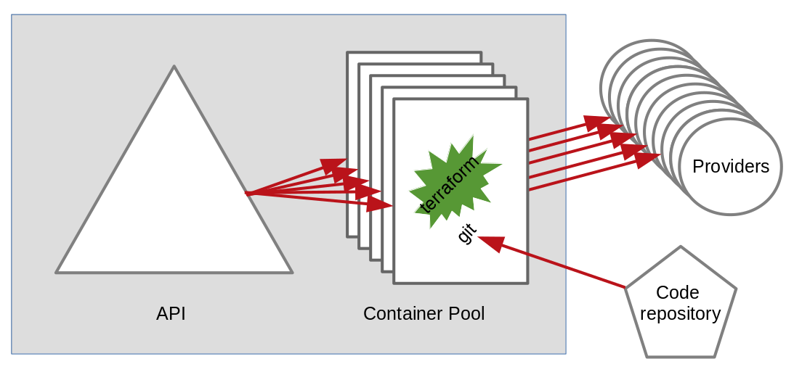

# Concept Guide

TODO: remove the dependency to terraform as it is not needed
TODO: Add vocabulary and specifically the project/workspace terms

## Architecture overview

Terraform-deck is able to create/update and destroy several set of 
resources in parallel. It can run the `terraform` commands in the same
`directory` of the same project but with different `workspace` and at
different `commit`. It also supports running different version of
`terraform`. To perform these tasks, Terraform-deck relies on a pool
of containers running `terraform`, `git` and connected to your
repository as show in the schema below:

Terraform-deck main components are:

- The `API`, that is a NodeJS/OpenAPI project which manage a pool of containers
- A `container pool`, each of which are docker images runing `debian`, `terraform` and `git`
- The `API` and `containers` all interact with a code repository
- The `API` runs `terraform` via `containers` and interact with the outer world managed by `terraform providers`

## Supported operations

Terraform-deck supports the following set of operations:

- An authentication model based on an API Key that grant a JWT token to manage
- The ability to list the environments and workspaces that can be provisionned
- For a given project, the ability to list all the tags and branches that can be used to create and update it
- The ability to describe in details the status of an environment/workspace, including its progress
- The ability to create or update a given environment/workspace
- The ability to destroy a given environment/workspace
- The ability to check the status of an environment
- The ability to extract the history of an environment/workspace, including the associated events and the running ranges
- The ability to reserve one of N environments for users
