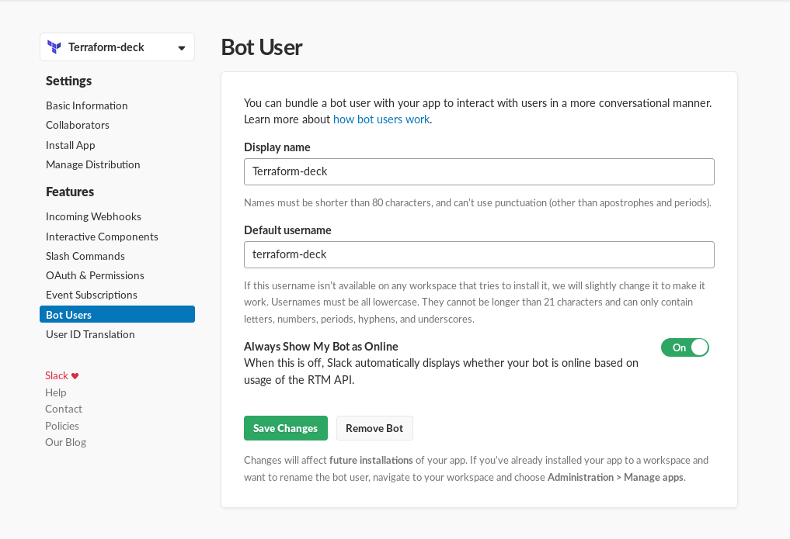
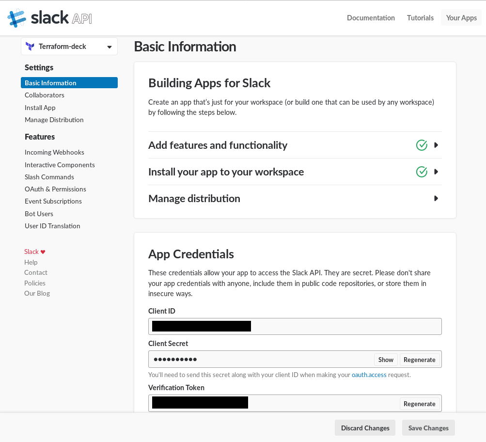
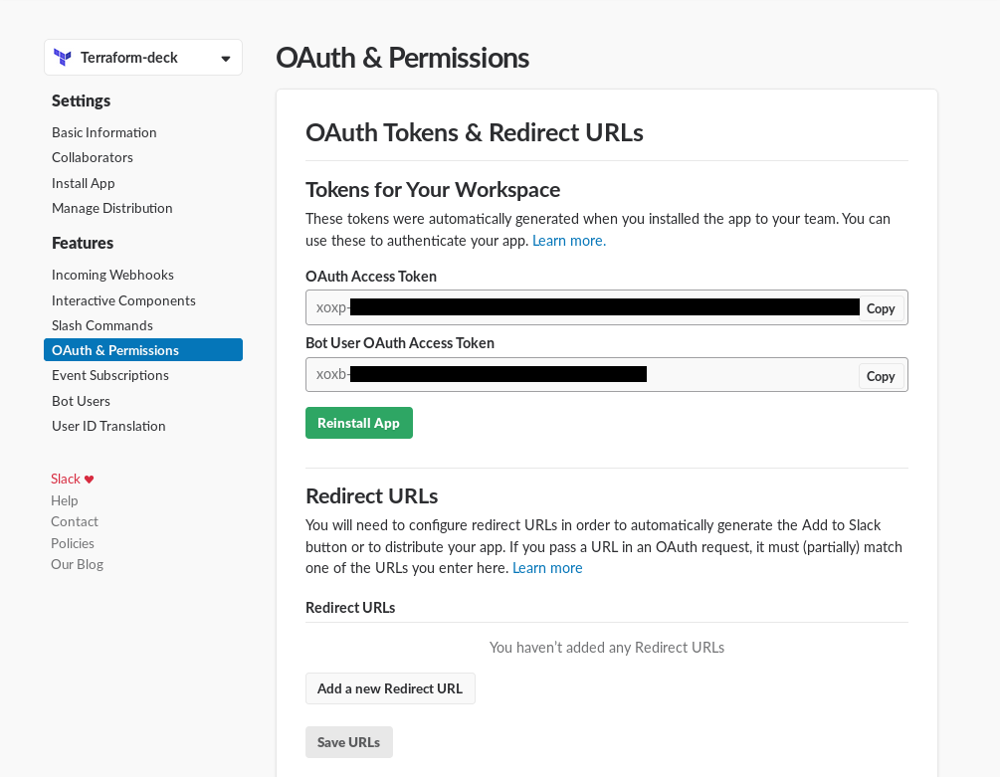
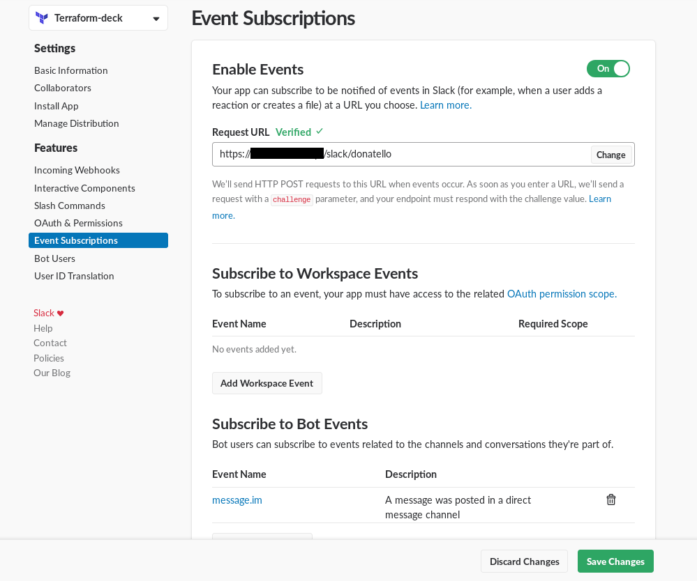
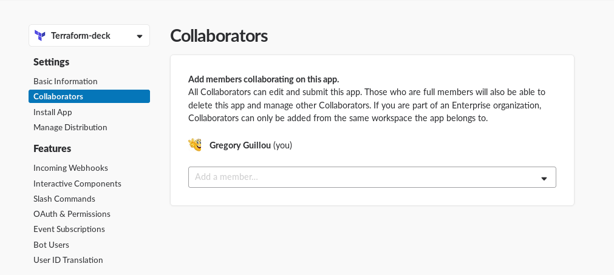
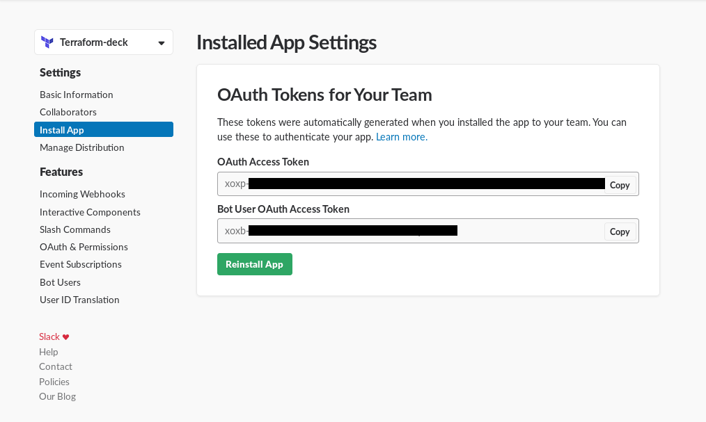
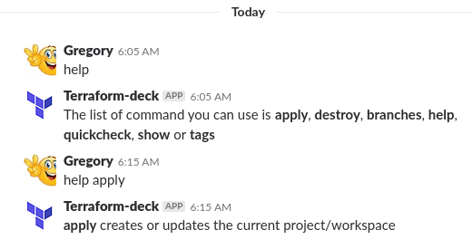

# Deploy and manage `Bots`

`Bots` is the service to integrate messaging platforms. For now only Slack is
supported but if you are interested with another platform you can easily add it
here. Bots can downloaded from 
[the Docker Hub](https://hub.docker.com/r/gregoryguillou/terraform-api/tags/).
It is the container suffixed with vX.Y.Z-bots. In order to deploy and configure
bots, you need to:

- create an application with a user bot in Slack
- configure `Bots` to manage messages from Slack
- modify your application so that it notifies `Bots`
- Test Slack to make sure it is working

The sections below describe these steps.

## Create a Slack application

You must be able to manage the Slack workspace to create an application. If
that is the case, you can connect to Slack on your browser and navigate to
the [following URL](https://api.slack.com/apps). You should be able to create
an application from here as shown below:


The way Bots interacts with Slack is via a user bot. You should create one
as show below:



Next steps consist in collecting the various secrets to allow Slack and Bots
to work together. The first one is the `Application token` that you can get
from the basic information page. This token is a secret that Slack will always
send to Bots and it would prevent anyone from using the API, except for Slack.
This token is available in the `Verification Token` field like below:



The second information to collect is the `User Bot Token` that is needed by
`Bots` to send information to Slack. You can get its value from the OAuth and
Permission page and it starts with `xoxb-` as you can see from the image below:



## Configure Bots to manage the Slack Application

You can configure `Bots` by adding a configuration file in the following file
`/app/config/settings.yaml` in the Bots container. The file is a yaml file that
list a set of bots like below:

```yaml
bots:
  - name: donatello
    type: slack
    apiurl: https://terraform-api:10010
    apikey: notsosecretadminkey
    project: demonstration
    workspace: staging
    slack:
      app_token: yyy
      userbot_token: xoxb-xxx
```

The file parameters are the following:

- `name` is the name of the bot. It enables bots to serve several bots by
  adding it as a suffix for the URL. For instance if you publish the API
  on https://bots.example.org and its name is donatello, the URL to
  register in the Slack event API will be
  `https://bots.example.org/slack/donatello`
- `type` should be set to `slack` as it is the only supported messaging
  system so far.
- `apiurl` and `apikey` should contain a Terraform API Url and Key
- `project` and `workspace` should point to a valid project and workspace
  managed by the terraform API. For now each bot can only interact
  with a single project/workspace
- `app_token` should be set to the `application token` as collected on
  Slack
- `userbot_token` should be set to the `user bot token` as collected on
  Slack and starting with `xoxb-`

> **Important**: The bot must be exposed on the Internet via `HTTPS`.
  The easiest way to do that is to create a DNS entry and use a
  loadbalancer to do it. We would suggest you hold the SSL Certificate on
  the loadbalancer and you prevent the API to be accessed from anywhere
  but from the loadbalancer. However, `Bots` relies on ExpressJS and
  you can setup the configuration of your choice if needed.

## Configure Slack notify Bots

Once you've configured and started Bots, you should be able to configure
Slack so that it notifies it. In order to proceed, go the the
`Event Subscriptions` page, **enable it** and make Slack point to Bots
with its base URL suffixed by `/slack/[bot name]`. Assuming `Bots` is 
correctly configured, you should get a `Verified` turning to green like
below.



You should add the **`message.im`** Subcribe to Bots Events so that
Bots gets messages you send via Direct Messages (DM). Once done, click 
one the `Save Changes` button.

The next step consists in granting access to `Bots` to specific users.
In order to proceed, go to the `Colaborators` tab and add the users you
want to be able to interact with your bot:



To finish with the configuration, you must `Reinstall the application`
so that it propagates the right permissions to the users. This would
get you through an OAuth screen so that you can agree your Slack
workspace to interact with the bot:



The OAuth Authorization screen looks like below:


## Test Slack with `Bots`

You should be ready to interact with your bot from Slack. Simply type
`help` to get some help like below:


